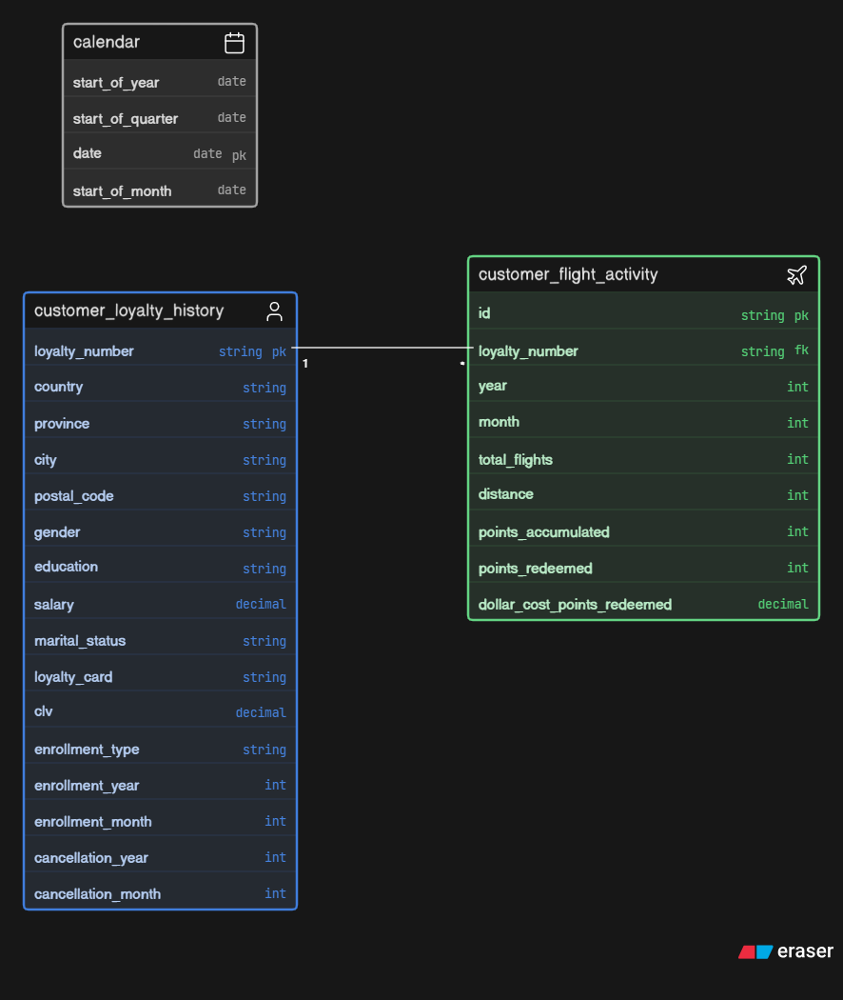

# ✈️ FlightSense: Loyalty Program Behavioral Intelligence & Retention Platform

This project provides an end-to-end data science and predictive analytics system designed for a mid-sized airline loyalty program. By combining predictive modeling, customer micro-segmentation, and concrete CRM campaign mapping, it replaces backward-looking metrics with forward-looking behavioral intelligence to proactively prevent customer churn and maximize Customer Lifetime Value (CLV).

## 📋 Project Overview

Loyalty programs are traditionally managed using backward-looking indicators (e.g., accumulated points or historical spending). However, members often stay inactive or disengage silently long before they formally cancel their membership, leaving marketing teams to react when it is already too late.

To address this, we developed **FlightSense**, a data-driven customer intelligence system built from ~16,700 Canadian loyalty members active between 2012 and 2018. The platform accomplishes three core objectives:

1. **Churn Prediction**: Identify members likely to stop engaging in the next 3 to 6 months by defining behavioral disengagement and building leakage-free classifiers.
2. **Customer Segmentation & Value**: Evaluate forward-looking customer value beyond historical CLV. We construct a multi-dimensional **Future Value Score (FVS)** that merges demographic signals (salary, education, marital status, card tier) with behavioral signals (flight frequency, redemption patterns, seasonal activity).
3. **Smart Retention**: Connect churn risk models directly to concrete, actionable CRM retention campaigns specifying who receives them, when, why, and the estimated return on investment (ROI).

## 📊 Dataset & ER Relationship

The database compiles monthly records spanning 2012–2018. It integrates four primary datasets:

* **Customer Loyalty History** (16,738 unique members): Contains customer demographics (gender, education, salary, marital status, location), enrollment dates, cancellation records, loyalty tier, and historical CLV.
* **Customer Flight Activity** (405,624 monthly activity rows): Records monthly flights booked, distance flown, points accumulated, points redeemed, and the dollar cost of redemptions.
* **Calendar**: Date dimension mapping months to quarters and seasonal travel periods.
* **Data Dictionary**: Schema definitions for all database fields.

### Data Anomalies Resolved
* **Missing Data Imputation**: Demographic fields like `Salary` contained missing values (~3,000 cases). These were imputed using medians grouped by `Education` x `Province` to preserve local income distributions.
* **Outlier Capping**: Extreme values in monthly flights and distance flown were capped at the 99th percentile using IQR-based bounds to protect predictive models from noise.
* **Consistency Treatment**: Removed spatial anomalies and corrected negative flight/distance entries.

### Entity-Relationship Diagram
The diagram below illustrates the structural links between the loyalty, flight, and calendar tables:



* **Relationship Mapping**:
  * `Customer Loyalty History` is the master table (1-to-many relationship with `Customer Flight Activity` on the primary key `Loyalty Number`).
  * `Customer Flight Activity` contains month-by-month time-series facts, linked in a many-to-1 relationship to the `Calendar` lookup table on the `Year` and `Month` columns.

## 📓 Notebooks Pipeline

The analytics pipeline is structured sequentially across 11 Jupyter notebooks in the `notebooks/` directory. Each handles a distinct stage of the project:

1. **[01_data_understanding.ipynb](notebooks/01_data_understanding.ipynb)**: Audits raw schemas, validates data types, and computes baseline statistical properties.
2. **[02_data_cleaning.ipynb](notebooks/02_data_cleaning.ipynb)**: Performs missing value imputation (median grouping), outlier capping, and duplicates removal.
3. **[03_churn_definition.ipynb](notebooks/03_churn_definition.ipynb)**: Constructs the hybrid churn label, combining formal cancellations with a 6-month behavioral inactivity threshold.
4. **[04_feature_engineering.ipynb](notebooks/04_feature_engineering.ipynb)**: Engineers customer-level behavioral metrics across 7 categories (recency, frequency, monetary, trends, loyalty, behavioral ratios, risk) using strict temporal cuts to avoid data leakage.
5. **[05_eda.ipynb](notebooks/05_eda.ipynb)**: Explores distributions, checks correlations, and highlights trends in customer travel and points accumulation.
6. **[06_predictive_modeling.ipynb](notebooks/06_predictive_modeling.ipynb)**: Trains classifiers and optimizes hyperparameters (Logistic Regression, Random Forest, LightGBM, XGBoost) using Optuna.
7. **[07_future_value_score.ipynb](notebooks/07_future_value_score.ipynb)**: Formulates the FVS score, assigning normalized weights to rolling frequency, trends, redemption behavior, and loyalty tiers.
8. **[08_customer_segmentation.ipynb](notebooks/08_customer_segmentation.ipynb)**: Groups members into K-Means clusters (Champions, VIP At Risk, Loyal Travelers, Growth Potential, Dormant Members) using Churn Risk and FVS.
9. **[09_retention_recommendations.ipynb](notebooks/09_retention_recommendations.ipynb)**: Maps segments to concrete CRM marketing campaigns with costs, success ratios, and action priorities.
10. **[10_model_explainability.ipynb](notebooks/10_model_explainability.ipynb)**: Extracts global and local SHAP (SHapley Additive exPlanations) values to interpret model decisions.
11. **[11_revenue_simulator.ipynb](notebooks/11_revenue_simulator.ipynb)**: Simulates revenue saved and ROI across different retention rate scenarios.

## 🧠 Predictive Modeling & Performance Metrics

Because loyalty programs are highly stable, churn represents an imbalanced class problem (~18% churn rate). To address this, model training optimized for **Precision-Recall AUC (PR-AUC)** rather than simple Accuracy.

The optimal model selected is **XGBoost (Tuned)**. 

| Metric | Score | Explanation |
| :--- | :--- | :--- |
| **Model Type** | XGBoost | Optimal gradient booster optimized via Optuna |
| **Accuracy** | **95.91%** | Overall correct predictions rate |
| **Precision** | **89.07%** | Out of all predicted churn targets, the percentage that actually churned |
| **Recall** | **86.05%** | Out of all actual churners, the percentage the model successfully flagged |
| **F1-Score** | **87.53%** | Balanced harmonic mean of Precision and Recall |
| **ROC-AUC** | **96.53%** | Receiver Operating Characteristic Area Under Curve |
| **PR-AUC** | **93.92%** | Precision-Recall Area Under Curve (main selection metric) |

## 🎯 Analytical Approach & Methodology

Our solution employs a structured strategy to connect raw datasets to marketing actions:

1. **Hybrid Churn Target**: We label a customer as churned if they explicitly cancelled their card OR became behaviorally inactive (0 flights and 0 points earned/redeemed in the last 6 months of the dataset). 
2. **Leakage-Free Features**: To prevent temporal data leakage, all rolling features (3M, 6M, 12M averages) and trend slopes are calculated using data strictly prior to the prediction timestamp.
3. **Future Value Score (FVS)**: Instead of looking only at past CLV, we score members' future loyalty value using weighted coefficients:
   * **Normalized CLV** (20%)
   * **12-Month Flight Frequency** (20%)
   * **Engagement Trend Slope** (20%)
   * **Tenure Months** (15%)
   * **Loyalty Card Tier** (15%)
   * **Points Redemption Ratio** (10%)
4. **Behavioral K-Means Clustering**: We cluster customers on the 2D plane of Churn Risk Probability (from XGBoost) and FVS. This groups them into actionable cohorts:
   * **Champions**: High value, low risk. Protect with premium perks.
   * **VIP At Risk**: High value, high risk. Immediate priority save target.
   * **Loyal Travelers**: Stable value, low risk. Maintain standard campaigns.
   * **Growth Potential**: Low value, low risk. Target with bonus flight offers.
   * **Dormant Members**: Minimal value, high risk. Low-priority win-back targets.
5. **Campaign ROI Projection**: We estimate Net Protected Revenue as:
    $$\text{Net Saved Revenue} = (\text{At-Risk Members} \times \text{Success Rate} \times \text{Avg CLV}) - \text{Campaign Cost}$$
6. **Model Explainability via SHAP**: To bridge the gap between complex machine learning outputs and business action, we extract SHAP (SHapley Additive exPlanations) values at two levels:
   * *Global Explainability*: Identifies the most significant program-wide drivers of disengagement (e.g., months inactive, declining flight trend) to help the marketing team construct macro-level campaigns.
   * *Local Explainability*: Deconstructs the model's prediction for any individual customer. This displays the exact features contributing to their specific risk score, allowing managers to target them with personalized interventions.


## 🖥️ Interactive Business Dashboard

The front-end is an executive-ready, multi-page Streamlit application that closes the gap between data science outputs and marketing actions.

### Dashboard Pages
* **Executive Overview**: High-level KPIs (Total Customers, Average Churn Risk, Revenue at Risk, Average FVS), Loyalty Segment distribution pie chart, and FVS range histograms.
* **Churn Intelligence**: Displays model metrics (Accuracy, ROC-AUC, PR-AUC), top program-wide churn drivers derived via SHAP (e.g. Months Inactive, Earning Trend), and predicted churn probability curves.
* **Customer Segmentation**: Interactive 2D scatter plot (FVS vs Churn Risk), demographic comparison profile tables, and radar overlay comparisons.
* **Retention Command Center**: Prioritized CRM save target list (Critical, High, Medium, Low) filterable by segment and priority. Features an instant **Export to CRM (CSV)** download button.
* **Revenue Impact Simulator**: A interactive "what-if" scenario planning tool. Users adjust churn reduction success rates and campaign cost variables to visualize campaign budgets, saved CLV, and forecasted ROI percentages.
* **Customer 360 View**: Deep-dive search dropdown to inspect individual member profiles, FVS/risk gauge dials, individual SHAP behavioral diagnostics, and custom retention campaign checklists.

### Access URL
* **Local Access Link**: [http://localhost:8501/](http://localhost:8501/)

## 🚀 How to Run the System

### 1. Setup Environment
Ensure Python 3.11+ is installed, then install the required dependencies:
```bash
pip install -r requirements.txt
```

### 2. Launch the Streamlit Dashboard
Run the following command in the project root directory:
```bash
streamlit run dashboard/app.py
```
This will open the application in your default web browser at the local URL listed above.
